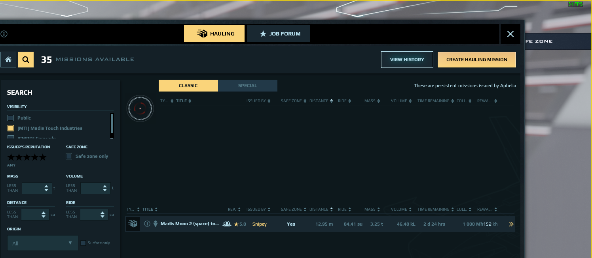
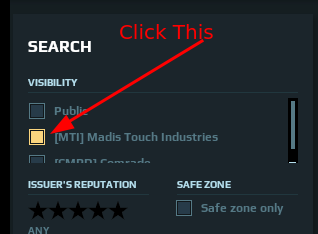
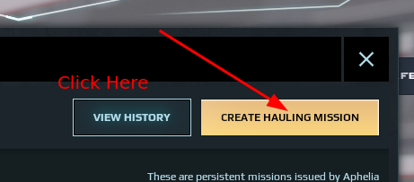
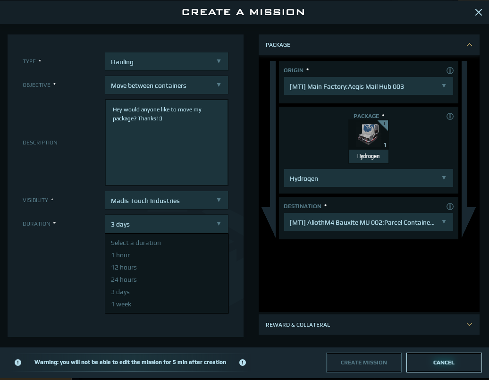

# Logistics 🚀

The logistics division is responsible for moving packages back and forth for the org.

## How can I contribute?

To contribute to the org in this manner we will be posting missions exclusively for members to fly. Most of these missions will be posted for `3 days` to `1 week`.

## How can I view the missions?

To view the missions press `F8` and click the 🔎 icon.

You should see missions posted for MTI members only.

When you see this page on the left you should spot a `search box` click on `[MTI] Madis Touch Industries`

After you have done that you can click **SEARCH**

## How can I post missions for other members?

To view the missions press `F8` and click the `CREATE HAULING MISSION` icon.

Once you are on the screen you can set the details for the mission

Make sure you set the visibility to `MTI`

